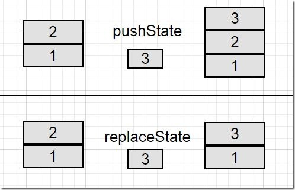

## 浏览器支持

在写这篇文章的时候，各主流浏览器对History API的支持是非常不错的，可以点击此处查看其支持情况，这个链接会告诉你支持的浏览器，并使用之前，总有良好的实践来检测支持的特定功能。

为了用变成方式确定浏览器是否支持这个API，可以用下面的一行代码检验：

```XHTML
return !!(window.history && history.pushState);
```
此外,我建议参考一下这篇文章:[Detect Support for Various HTML5 Features](http://www.xpertdeveloper.com/2014/08/detect-html5-features/).

如果你是用的现代浏览器，可以用下面的代码：

```XHTML
if (Modernizr.history) {
    // History API Supported
}
```
如果你的浏览器不支持History API，可以使用[history.js](https://github.com/browserstate/history.js/)代替。

使用History

HTML 5提供了两个新方法：

1、 `history.pushState()`;                
2、 `history.replaceState()`;

两种方法都允许我们添加和更新历史记录，它们的工作原理相同并且可以添加数量相同的参数。除了方法之外，还有`popstate`事件。在后文中将介绍怎么使用和什么时候使用popstate事件。

`pushState()`和`replaceState()`参数一样，参数说明如下：

1、 `state`：存储JSON字符串，可以用在popstate事件中。

2、 `title`：现在大多数浏览器不支持或者忽略这个参数，最好用null代替

3、 `url`：任意有效的URL，用于更新浏览器的地址栏，并不在乎URL是否已经存在地址列表中。更重要的是，它不会重新加载页面。

两个方法的主要区别就是：`pushState()`是在history栈中添加一个新的条目，`replaceState()`是替换当前的记录值。如果你还对这个有迷惑，就用一些示例来证明这个区别。

假设我们有两个栈块，一个标记为1,另一个标记为2，你有第三个栈块，标记为3。当执行`pushState()`时，栈块3将被添加到已经存在的栈中，因此，栈就有3个块栈了。

同样的假设情景下，当执行`replaceState()`时，将在块2的堆栈和放置块3。所以history的记录条数不变，也就是说，`pushState()`会让history的数量加1.

比较结果如下图：



 
到此，为了控制浏览器的历史记录，我们忽略了`pushState()`和`replaceState()`的事件。但是假设浏览器统计了许多的不良记录，用户可能会被重定向到这些页面，或许也不会。在这种情况下，当用户使用浏览器的前进和后退导航按钮时就会产生意外的问题。

尽管当我们使用`pushState()`和`replaceState()`进行处理时，期待popstate事件被触发。但实际上，情况并不是这样。相反，当你浏览会话历史记录时，不管你是点击前进或者后退按钮，还是使用history.go和history.back方法，popstate都会被触发。

In WebKit browsers, a popstate event would be triggered after document’s onload event, but Firefox and IE do not have this behavior.（在WebKit浏览器中，popstate事件在document的onload事件后触发，Firefox和IE没有这种行为）。